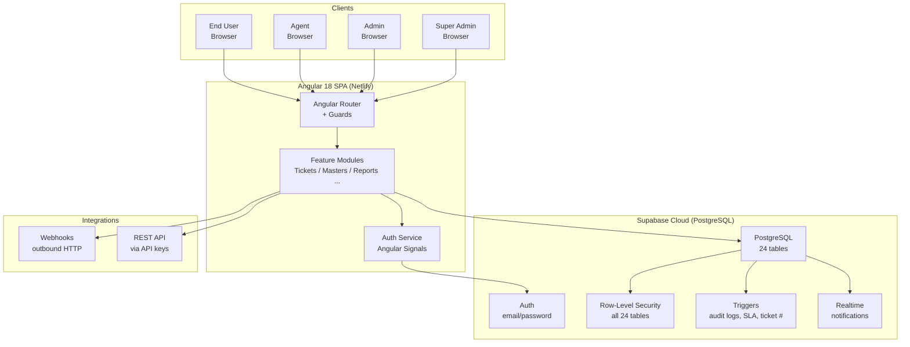

# Enterprise Ticket System — Product Overview

> One-pager for stakeholders, product managers, and executive decision-makers.

---

## What Is It?

Enterprise Ticket System is a production-grade IT Service Management (ITSM) platform. It gives organizations a single, structured place to create, track, assign, escalate, and resolve service requests — with full audit history, SLA enforcement, and automation built in from day one.

Think of it as a self-hosted, fully owned alternative to Jira Service Management or Zendesk — without the per-seat licensing costs and without vendor lock-in.

---

## Problem Statement

Most mid-size organizations face these challenges before adopting a proper ITSM tool:

- **No unified tracking.** Requests arrive by email, chat, and phone. Nothing is logged or traceable.
- **Manual assignment.** IT managers manually route tickets to agents — slow and error-prone.
- **SLA misses go unnoticed.** No automated escalation means issues sit until someone complains.
- **No audit trail.** Compliance reviews reveal no record of who changed what, or when.
- **Integration gaps.** Existing tools (monitoring, HR systems, webhooks) cannot talk to a central ticketing system.

---

## Solution

Enterprise Ticket System solves all five problems out of the box:

- Every request becomes a structured ticket with a unique ID (TICK-#####)
- Tickets are automatically assigned to agents or queues based on automation rules
- SLA policies are evaluated continuously — breaches trigger escalation chains automatically
- Every change to every ticket is captured in an immutable audit log
- Webhooks and REST API keys enable integration with any external tool

---

## Core Capabilities

| Capability | Description |
|---|---|
| **Ticket Lifecycle Management** | Create, assign, escalate, resolve, and close tickets. Full status workflow with custom transitions. |
| **SLA Engine** | Policy-based response and resolution deadlines. Automatic pause/resume on pending status. Breach alerts. |
| **Workflow Builder** | Visual state machine. Define which statuses can transition to which. Set role-based transition restrictions and approval gates. |
| **Automation Rules** | Event-driven rules that fire on ticket events (created, updated, status changed, SLA breached, etc.). Assign, notify, tag, change status, call webhooks — automatically. |
| **13 Master Data Modules** | Configure every dimension of the system: roles, departments, categories, priorities, statuses, ticket types, queues, service catalog, custom fields, escalation matrices, approval rules, and more. |
| **Audit Logging** | Immutable change history for every ticket and comment. Before/after diff viewer. Actor and timestamp recorded for every event. |
| **REST Integrations** | Generate scoped API keys. Configure outbound webhooks for any ticket event. |
| **Reports & Analytics** | Ticket analytics (volume, categories, priorities), SLA compliance reports, agent productivity dashboards. |
| **Role-Based Access** | Four roles with precisely scoped permissions. Row-Level Security enforced at the database layer — not just the frontend. |
| **System Overview** | Super Admin control center showing system health, ticket breakdown, configuration status, and integration health at a glance. |

---

## Who Uses It?

| Role | What They Do |
|---|---|
| **Super Admin** | Configures the entire system. Builds workflows, automation rules, SLA policies. Manages integrations. Views the System Overview control center. |
| **Admin** | Manages users, master data, SLA policies, and reports. Can handle tickets at any stage. |
| **Agent** | Receives and resolves assigned tickets. Can view all tickets in their queue. Posts comments, updates status, escalates when needed. |
| **End User** | Creates tickets and tracks their own requests. Receives notifications on status changes. |

---

## Key Differentiators

> Why choose this system over off-the-shelf alternatives?

- **Database-layer security.** Row-Level Security (RLS) is enforced directly in PostgreSQL on all 24 tables. Even a misconfigured frontend cannot leak data from other users.
- **Full schema ownership.** You receive and own the complete database schema across 10 migration files. No black-box backend.
- **Instant deployment.** One `npx ng build` + drag to Netlify. No Kubernetes, no Docker, no servers to manage.
- **Zero per-seat cost.** Supabase free tier handles thousands of users. Scale up only when needed.
- **Audit-ready from day one.** Every ticket change, status transition, and reassignment is logged automatically via database triggers — no application code required.
- **Extensible without code changes.** Custom fields, service catalog items, automation rules, and notification templates can all be added from the admin UI without touching the source code.

---

## System Architecture

---

## Compliance and Security

| Control | Implementation |
|---|---|
| **Authentication** | Supabase Auth — email/password, session tokens, auto-refresh |
| **Authorization** | Role-based (super_admin / admin / agent / end_user). Enforced in Angular guards AND Supabase RLS policies |
| **Data isolation** | RLS policies on all 24 tables prevent any cross-user data access |
| **Audit trail** | Database triggers on tickets and comments capture every INSERT/UPDATE/DELETE with actor ID, timestamp, old values, and new values |
| **API key security** | Keys stored as SHA-256 hash in the database. Full key shown only once at creation |
| **Session security** | JWT sessions auto-refresh. Tokens not exposed in application code |
| **Input validation** | Client-side reactive form validation + Supabase CHECK constraints at the database layer |

---

*For technical deployment details, see [Deployment Guide](03-deployment-guide.md).*
*For admin operations, see [Admin Guide](04-admin-guide.md).*
