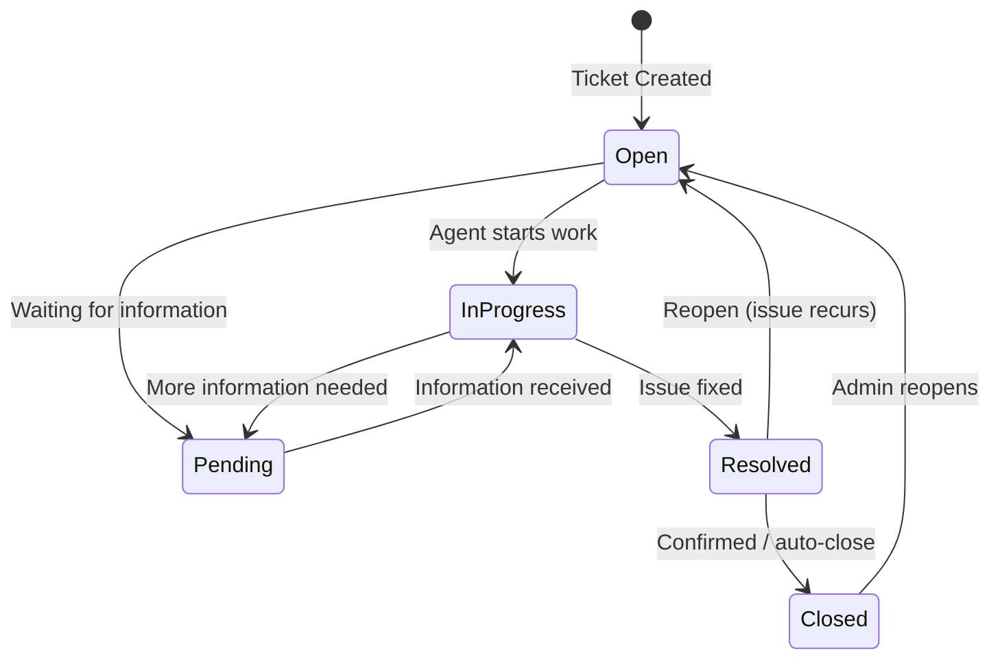

# Agent & End User Guide

> For agents handling tickets daily, and end users creating and tracking their service requests.

---

## Getting Started

When your administrator adds you to the system, you receive an email invitation. Click the link, set your password, and you are ready to use the system.

Your experience varies by role:
- **End User** — create tickets, track your own requests, receive notifications
- **Agent** — everything end users can do, plus handle assigned tickets, view all tickets, add internal notes, change status and priority

---

## Logging In

1. Navigate to your organization's Enterprise Ticket System URL
2. Enter your email address and password
3. Click **Sign In**

If you forget your password, click **Forgot password?** on the login page and follow the email instructions.

---

## Your Dashboard

After logging in you land on the Dashboard. It shows:

| Card | What It Means |
|---|---|
| **Total Tickets** | All tickets in the system |
| **Open** | Tickets waiting for action |
| **In Progress** | Tickets actively being worked on |
| **Pending** | Tickets paused (waiting for information) |
| **Resolved** | Tickets that have been fixed |
| **Closed** | Tickets that are fully complete |
| **SLA Breached** | Tickets where a deadline was missed |
| **Escalated** | Tickets that have been escalated due to urgency |

Below the cards you will see a ticket trend chart (last 7 days), an SLA compliance doughnut chart, and — for admins — an agent workload table.

---

## Creating a Ticket

1. Click **Tickets** in the sidebar, then **Create Ticket** — or click the **Create Ticket** button on the Dashboard
2. Fill in the **Subject / Title** — be specific (e.g., "Cannot access VPN from home" is better than "Network issue")
3. Select the **Ticket Type** — Incident, Service Request, Problem, Change Request, or Task
4. Select the **Priority** — Critical, High, Medium, or Low
5. Select the **Category** — the area your request falls under (e.g., Network, Software, HR Request)
6. Add a **Description** — include steps to reproduce, error messages, or any relevant details
7. Add **Tags** if helpful (comma-separated)
8. Set a **Due Date** if there is a deadline
9. Attach files by dragging them into the attachment area or clicking to browse (max 10 MB per file)
10. Click **Create Ticket**

Your ticket is assigned a unique number (TICK-#####) immediately. You will receive a notification confirming it was created.

---

## Viewing Your Tickets

### My Tickets

**Sidebar → Tickets → My Tickets** shows only the tickets you submitted (as requester). This is the default view for end users.

### All Tickets (Agents and Admins Only)

**Sidebar → Tickets → All Tickets** shows every ticket in the system. Use the filters at the top to narrow by status, priority, or search by ticket number / title.

---

## Ticket Detail — What Each Section Shows

When you click on a ticket, you see the full detail view.

| Section | What It Shows |
|---|---|
| **Header** | Ticket number, title, type badge, edit toggle |
| **Description** | Full request text, who submitted it, when |
| **Attachments** | Files uploaded to the ticket — click to download |
| **Comments / Activity** | All replies and status change history, newest first |
| **Status & Priority** | Current status and priority (editable by agents/admins) |
| **SLA Timer** | Response deadline and resolution deadline with color-coded progress bar |
| **People** | Requester (who submitted) and Assignee (who is handling it) |
| **Metadata** | Ticket number, type, category, department, source, dates |

### Understanding the SLA Timer

The SLA timer shows two deadlines:

- **Response SLA** — how long until an agent must first reply
- **Resolution SLA** — how long until the ticket must be resolved

Color coding:
- **Green** — more than 50% of time remaining
- **Yellow** — under 50% of time remaining
- **Red** — SLA breached or less than 10% time remaining

The SLA clock pauses automatically when a ticket enters "Pending" status and resumes when it moves back to "In Progress" or "Open."

---

## Ticket Status Lifecycle

| Status | What It Means |
|---|---|
| **Open** | Ticket submitted, not yet picked up |
| **In Progress** | Agent is actively working on it |
| **Pending** | Paused — waiting for more information from the requester |
| **On Hold** | Paused — waiting for a third party or scheduled maintenance |
| **Resolved** | The agent has fixed the issue and is awaiting confirmation |
| **Closed** | Fully complete — no further action needed |
| **Cancelled** | Ticket was withdrawn or invalid |

---

## Adding Comments

You can add a comment on any ticket you have access to:

1. Scroll to the **Comments** section at the bottom of the ticket detail
2. Type your message in the text area
3. Choose the comment type:
   - **Reply to requester** (default) — visible to everyone including the requester
   - **Internal note** (agents/admins only) — private, highlighted in amber, not visible to the requester
4. Click **Post Comment**

> **Tip for agents:** Use internal notes to document your troubleshooting steps or leave notes for colleagues without the requester seeing your working notes.

---

## Notifications

The notification bell (top right header) shows your unread notifications in real time.

### Notification Types

| Type | When You Receive It |
|---|---|
| **Assignment** | A ticket is assigned to you |
| **Ticket Update** | A ticket you are watching is updated |
| **SLA Breach** | An SLA deadline is missed on a ticket you are assigned |
| **Mention** | Someone @mentions you in a comment |
| **Escalation** | A ticket assigned to you is escalated |
| **Approval** | An approval decision is required from you |

### Managing Notifications

1. Click the **bell icon** in the top right corner — a slide-over panel opens
2. Switch between **All** and **Unread** to filter
3. Click any notification to navigate directly to the related ticket
4. Click **Mark all read** to clear the unread count

---

## Profile Settings

### Updating Your Profile

1. Click your name / avatar in the top right of the header
2. Select **My Profile**
3. In the **Personal Information** section, update your **Full Name**, **Phone**, and **Timezone**
4. Click **Save Changes**

### Changing Your Password

1. Go to **My Profile**
2. Scroll to the **Password** section
3. Enter your new password (minimum 8 characters) and confirm it
4. Click **Update Password**

### Changing Your Email Address

1. Go to **My Profile**
2. In the **Email** section, enter your new email address
3. Click **Send Confirmation**
4. Check your new email inbox and click the confirmation link
5. Your email is updated after you click the link

---

## For Agents: Additional Capabilities

As an agent, you have extra tools beyond what end users see.

### Assigning a Ticket to Yourself

1. Open a ticket
2. Click the **Edit** button (top right)
3. In the **People** section, set **Assignee** to yourself
4. Click **Save**

### Changing Ticket Status

1. Open a ticket and click **Edit**
2. In the **Status & Priority** card, use the **Status** dropdown
3. Select the new status
4. Click **Save** — the change is recorded in the comment/activity timeline automatically

### Changing Priority

Same steps as changing status — use the **Priority** dropdown in edit mode.

### Adding an Internal Note

1. Open a ticket
2. In the **Comments** section, check **Internal note** before posting
3. Type your note and click **Post**

Internal notes appear with a gold/amber background and are never visible to the requester.

### Escalating a Ticket

If a ticket requires attention beyond your scope:
1. Contact your admin to manually escalate, or
2. If automation rules are configured for escalation, they will trigger automatically based on SLA breach or priority change

---

## Glossary

| Term | Definition |
|---|---|
| **Ticket** | A structured record of a service request or issue |
| **TICK-#####** | Unique ticket number auto-assigned at creation |
| **SLA** | Service Level Agreement — the deadline by which a ticket must be responded to and resolved |
| **Escalation** | Automatic or manual process that notifies senior staff or changes assignment when a ticket is overdue |
| **Queue** | A group of agents that handle a specific category of tickets (e.g., IT Support, Network Team) |
| **Priority** | Urgency level — Critical, High, Medium, or Low — affects SLA deadlines |
| **Status Category** | The phase of the lifecycle: open, in_progress, pending, resolved, or closed |
| **Internal Note** | A comment visible only to agents and admins — not shown to the requester |
| **Requester** | The user who submitted the ticket |
| **Assignee** | The agent or admin responsible for resolving the ticket |
| **Workflow** | The set of allowed status transitions for a ticket type |
