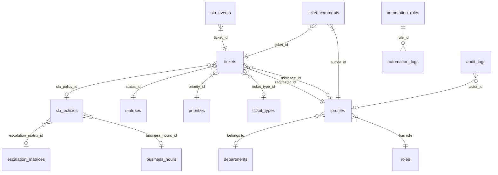

# Database Schema Reference

> Complete reference for all 24 tables, Row-Level Security policies, database functions, triggers, and seed data.

---

## Overview

| Metric | Value |
|---|---|
| Total tables | 24 |
| Migration files | 10 |
| Primary key type | UUID (via `uuid-ossp` extension) |
| Password hashing | `pgcrypto` extension |
| RLS policies | Enabled on all 24 tables |
| Trigger functions | 6 |
| Seeded roles | 4 (super_admin, admin, agent, end_user) |

All timestamps are `TIMESTAMPTZ` (UTC). All `created_by` / `updated_by` columns are foreign keys back to `profiles.id`.

---

## Migration Files

| File | Tables Created |
|---|---|
| `001_core_tables.sql` | roles, departments, profiles |
| `002_ticket_tables.sql` | priorities, statuses, categories, ticket_types, queues, queue_members, tickets, ticket_links, ticket_comments, ticket_attachments |
| `003_workflow_tables.sql` | approval_rules, workflow_definitions, workflow_transitions, approval_requests |
| `004_sla_tables.sql` | business_hours, escalation_matrices, escalation_rules, escalation_logs, sla_policies, sla_events |
| `005_automation_tables.sql` | automation_rules, automation_logs, webhook_configs |
| `006_notification_tables.sql` | notification_templates, notifications, service_catalog, custom_fields |
| `007_audit_tables.sql` | audit_logs, api_keys, ticket_watchers |
| `008_rls_policies.sql` | Row-Level Security policies on all tables |
| `009_functions_triggers.sql` | Functions and triggers for audit, SLA, ticket numbering, user creation |
| `010_seed_data.sql` | Default configuration data |

---

## Entity Relationship Diagram



---

## Migration 001 — Core Identity Tables

### `public.roles`

Defines user permission sets. System roles are immutable.

| Column | Type | Notes |
|---|---|---|
| `id` | UUID PK | auto-generated |
| `name` | TEXT UNIQUE NOT NULL | e.g., "Super Admin" |
| `slug` | TEXT UNIQUE NOT NULL | e.g., "super_admin" |
| `description` | TEXT | |
| `permissions` | JSONB | capability matrix |
| `is_system` | BOOLEAN DEFAULT FALSE | system roles cannot be deleted |
| `is_active` | BOOLEAN DEFAULT TRUE | |
| `created_at`, `updated_at` | TIMESTAMPTZ | |
| `created_by`, `updated_by` | UUID FK → profiles | |

**Indexes:** slug, is_active

---

### `public.departments`

Organizational hierarchy. Supports parent-child nesting.

| Column | Type | Notes |
|---|---|---|
| `id` | UUID PK | |
| `name` | TEXT UNIQUE NOT NULL | |
| `code` | TEXT UNIQUE NOT NULL | e.g., "IT" |
| `description` | TEXT | |
| `head_id` | UUID FK → profiles | department head |
| `parent_id` | UUID FK → departments | self-reference for hierarchy |
| `is_active` | BOOLEAN DEFAULT TRUE | |
| `created_at`, `updated_at`, `created_by`, `updated_by` | | |

**Seeded:** IT, HR, Finance, Operations, Customer Success

---

### `public.profiles`

Extends `auth.users`. One row per user.

| Column | Type | Notes |
|---|---|---|
| `id` | UUID PK FK → auth.users | matches Supabase auth ID |
| `employee_id` | TEXT UNIQUE | optional HR identifier |
| `full_name` | TEXT NOT NULL | |
| `email` | TEXT UNIQUE NOT NULL | |
| `phone` | TEXT | |
| `avatar_url` | TEXT | |
| `department_id` | UUID FK → departments | |
| `role_id` | UUID NOT NULL FK → roles | |
| `is_active` | BOOLEAN DEFAULT TRUE | |
| `timezone` | TEXT DEFAULT 'UTC' | |
| `preferences` | JSONB | user settings |
| `created_at`, `updated_at`, `created_by`, `updated_by` | | |

**Indexes:** role_id, department_id, email, is_active, employee_id

---

## Migration 002 — Ticket Domain Tables

### `public.priorities`

Priority levels with SLA multipliers.

| Column | Type | Notes |
|---|---|---|
| `id` | UUID PK | |
| `name` | TEXT UNIQUE NOT NULL | e.g., "Critical" |
| `slug` | TEXT UNIQUE NOT NULL | e.g., "critical" |
| `level` | INT CHECK (1–4) | 1=Critical, 4=Low |
| `color` | TEXT | hex color e.g., "#DC2626" |
| `icon` | TEXT | PrimeIcons class |
| `sla_multiplier` | NUMERIC(4,2) | 0.5 = 2× speed; 1.5 = 0.67× speed |
| `is_active` | BOOLEAN DEFAULT TRUE | |

**Seeded:** Critical (1, 0.5×), High (2, 0.75×), Medium (3, 1.0×), Low (4, 1.5×)

---

### `public.statuses`

Ticket lifecycle states.

| Column | Type | Notes |
|---|---|---|
| `id` | UUID PK | |
| `name` | TEXT UNIQUE NOT NULL | |
| `slug` | TEXT UNIQUE NOT NULL | |
| `category` | TEXT CHECK | open / in_progress / pending / resolved / closed |
| `color` | TEXT | hex color |
| `is_default` | BOOLEAN DEFAULT FALSE | applied to new tickets |
| `is_closed` | BOOLEAN DEFAULT FALSE | SLA stops when true |
| `sort_order` | INT | workflow sequence |
| `is_active` | BOOLEAN DEFAULT TRUE | |

**Seeded:** Open (default), In Progress, Pending, On Hold, Resolved, Closed (is_closed), Cancelled (is_closed)

---

### `public.categories`

Hierarchical ticket classification.

| Column | Type | Notes |
|---|---|---|
| `id` | UUID PK | |
| `name` | TEXT NOT NULL | |
| `code` | TEXT UNIQUE NOT NULL | |
| `description` | TEXT | |
| `parent_id` | UUID FK → categories | self-reference |
| `is_active` | BOOLEAN DEFAULT TRUE | |

**Seeded:** Hardware, Software, Network, Access & Security, Email, HR Request, Finance Request, General Inquiry

---

### `public.ticket_types`

Defines the types of tickets (Incident, Service Request, etc.).

| Column | Type | Notes |
|---|---|---|
| `id` | UUID PK | |
| `name` | TEXT UNIQUE NOT NULL | |
| `slug` | TEXT UNIQUE NOT NULL | |
| `description` | TEXT | |
| `icon` | TEXT DEFAULT 'pi pi-ticket' | |
| `default_priority_id` | UUID FK → priorities | |
| `default_workflow_id` | UUID FK → workflow_definitions | |
| `custom_field_schema` | JSONB | schema for dynamic fields |
| `is_active` | BOOLEAN DEFAULT TRUE | |

**Seeded:** Incident, Service Request, Problem, Change Request, Task

---

### `public.queues` / `public.queue_members`

Agent teams for ticket routing.

**queues:**

| Column | Type | Notes |
|---|---|---|
| `id` | UUID PK | |
| `name` | TEXT UNIQUE NOT NULL | |
| `description` | TEXT | |
| `team_lead_id` | UUID FK → profiles | |
| `is_active` | BOOLEAN DEFAULT TRUE | |

**queue_members** (junction table):

| Column | Type | Notes |
|---|---|---|
| `queue_id` | UUID PK FK → queues CASCADE | |
| `agent_id` | UUID PK FK → profiles CASCADE | |
| `joined_at` | TIMESTAMPTZ DEFAULT NOW() | |

**Seeded queues:** IT Support, Network Team, Security Team, HR Team, Finance Team

---

### `public.tickets` (Central Entity)

The main ticket table with 30+ columns.

| Column | Type | Notes |
|---|---|---|
| `id` | UUID PK | |
| `ticket_number` | TEXT UNIQUE NOT NULL | TICK-00001 format, auto-generated by trigger |
| `title` | TEXT NOT NULL | |
| `description` | TEXT | |
| `ticket_type_id` | UUID NOT NULL FK → ticket_types | |
| `status_id` | UUID NOT NULL FK → statuses | |
| `priority_id` | UUID NOT NULL FK → priorities | |
| `category_id` | UUID FK → categories | |
| `department_id` | UUID FK → departments | |
| `queue_id` | UUID FK → queues | |
| `requester_id` | UUID NOT NULL FK → profiles | |
| `assignee_id` | UUID FK → profiles | |
| `parent_ticket_id` | UUID FK → tickets | self-reference for sub-tickets |
| `due_date` | TIMESTAMPTZ | |
| `resolved_at` | TIMESTAMPTZ | set by status change trigger |
| `closed_at` | TIMESTAMPTZ | set by status change trigger |
| `custom_fields` | JSONB | dynamic field values |
| `tags` | TEXT[] | |
| `source` | TEXT CHECK | web / email / api / phone |
| `is_escalated` | BOOLEAN DEFAULT FALSE | |
| `escalated_at` | TIMESTAMPTZ | |
| `sla_policy_id` | UUID FK → sla_policies | |
| `sla_response_due` | TIMESTAMPTZ | |
| `sla_resolve_due` | TIMESTAMPTZ | |
| `sla_response_met` | BOOLEAN | set by first-response trigger |
| `sla_resolve_met` | BOOLEAN | set by status change trigger |
| `first_response_at` | TIMESTAMPTZ | set by trigger on first agent comment |
| `created_at`, `updated_at`, `created_by`, `updated_by` | | |

**Indexes:** 14 total — ticket_number, status_id, priority_id, requester_id, assignee_id, created_at DESC, sla_resolve_due, is_escalated, tags (GIN), full-text search on title+description

---

### `public.ticket_comments`

Ticket communication threads.

| Column | Type | Notes |
|---|---|---|
| `id` | UUID PK | |
| `ticket_id` | UUID NOT NULL FK → tickets CASCADE | |
| `author_id` | UUID NOT NULL FK → profiles | |
| `body` | TEXT NOT NULL | |
| `is_internal` | BOOLEAN DEFAULT FALSE | hidden from end users |
| `mentions` | UUID[] | mentioned user IDs |
| `created_at`, `updated_at`, `created_by`, `updated_by` | | |

---

### `public.ticket_attachments`

Files attached to tickets or comments.

| Column | Type | Notes |
|---|---|---|
| `id` | UUID PK | |
| `ticket_id` | UUID FK → tickets CASCADE | |
| `comment_id` | UUID FK → ticket_comments CASCADE | |
| `file_name` | TEXT NOT NULL | |
| `file_size` | BIGINT NOT NULL CHECK (> 0) | bytes |
| `mime_type` | TEXT NOT NULL | |
| `storage_path` | TEXT NOT NULL | Supabase Storage path |
| `uploaded_by` | UUID NOT NULL FK → profiles | |
| `created_at` | TIMESTAMPTZ | |

---

### `public.ticket_links`

Relationships between tickets.

| Column | Type | Notes |
|---|---|---|
| `id` | UUID PK | |
| `source_id` | UUID NOT NULL FK → tickets CASCADE | |
| `target_id` | UUID NOT NULL FK → tickets CASCADE | |
| `link_type` | TEXT CHECK | relates_to / blocks / is_blocked_by / duplicates / is_duplicated_by / parent_of / child_of |
| `created_at` | TIMESTAMPTZ | |
| `created_by` | UUID FK → profiles | |

---

## Migration 003 — Workflow Engine

### `public.workflow_definitions`

Named state machine definitions.

| Column | Type | Notes |
|---|---|---|
| `id` | UUID PK | |
| `name` | TEXT UNIQUE NOT NULL | |
| `is_default` | BOOLEAN DEFAULT FALSE | |
| `is_active` | BOOLEAN DEFAULT TRUE | |

**Seeded:** "Standard IT Workflow" (is_default = true)

---

### `public.workflow_transitions`

Edges in the workflow state machine.

| Column | Type | Notes |
|---|---|---|
| `id` | UUID PK | |
| `workflow_id` | UUID NOT NULL FK → workflow_definitions CASCADE | |
| `name` | TEXT NOT NULL | transition label |
| `from_status_id` | UUID FK → statuses | NULL = initial state |
| `to_status_id` | UUID NOT NULL FK → statuses | |
| `allowed_roles` | TEXT[] | role slugs |
| `requires_approval` | BOOLEAN DEFAULT FALSE | |
| `approval_rule_id` | UUID FK → approval_rules | |
| `conditions` | JSONB | |
| `sort_order` | INT DEFAULT 0 | |
| `is_active` | BOOLEAN DEFAULT TRUE | |

**Seeded transitions (Standard IT Workflow):** Open→In Progress, Open→Pending, Open→Cancelled, In Progress→Pending, In Progress→Resolved, Pending→In Progress, Pending→Resolved, Resolved→Closed, Resolved→Open (Reopen), Closed→Open (Admin Reopen)

---

### `public.approval_rules` / `public.approval_requests`

Approval workflow definitions and instance tracking.

| approval_rules column | Type | Notes |
|---|---|---|
| `approval_type` | TEXT CHECK | sequential / parallel / any_one |
| `approver_roles` | TEXT[] | role slugs |
| `approver_ids` | UUID[] | specific user IDs |

| approval_requests column | Type | Notes |
|---|---|---|
| `ticket_id` | UUID NOT NULL FK → tickets | |
| `transition_id` | UUID NOT NULL FK → workflow_transitions | |
| `status` | TEXT CHECK | pending / approved / rejected / cancelled |
| `decided_by` | UUID FK → profiles | |
| `decision_at` | TIMESTAMPTZ | |

---

## Migration 004 — SLA Engine

### `public.business_hours`

Working hour schedules by timezone.

| Column | Type | Notes |
|---|---|---|
| `name` | TEXT UNIQUE NOT NULL | |
| `timezone` | TEXT DEFAULT 'Asia/Kolkata' | |
| `schedule` | JSONB | Mon–Sun: { enabled, start, end } |
| `holidays` | DATE[] | non-working dates |

**Seeded:** "Standard Business Hours" (9–6 Mon–Fri IST), "24×7 Support" (all hours UTC)

---

### `public.sla_policies`

SLA definitions linked to priorities and ticket types.

| Column | Type | Notes |
|---|---|---|
| `priority_id` | UUID FK → priorities | |
| `ticket_type_id` | UUID FK → ticket_types | optional restriction |
| `response_time_hours` | NUMERIC(8,2) NOT NULL | |
| `resolution_time_hours` | NUMERIC(8,2) NOT NULL | |
| `business_hours_id` | UUID FK → business_hours | |
| `escalation_matrix_id` | UUID FK → escalation_matrices | |

**Seeded:** Critical (1h/4h), High (2h/8h), Medium (4h/24h), Low (8h/72h)

---

### `public.sla_events`

Tracks SLA timing per ticket.

| Column | Type | Notes |
|---|---|---|
| `ticket_id` | UUID NOT NULL FK → tickets CASCADE | |
| `sla_policy_id` | UUID NOT NULL FK → sla_policies | |
| `event_type` | TEXT CHECK | response / resolution |
| `due_at` | TIMESTAMPTZ NOT NULL | |
| `met_at` | TIMESTAMPTZ | when SLA was met |
| `is_breached` | BOOLEAN DEFAULT FALSE | |
| `paused_at` | TIMESTAMPTZ | pause start time |
| `total_pause_mins` | INT DEFAULT 0 | cumulative pause duration |

---

### `public.escalation_matrices` / `public.escalation_rules` / `public.escalation_logs`

Multi-level escalation definitions and history.

**escalation_rules key columns:**

| Column | Notes |
|---|---|
| `level` | INT — escalation step (1, 2, 3...) |
| `trigger_after_mins` | Minutes after SLA breach to fire this step |
| `escalate_to_role` | Role slug to notify/reassign |
| `action` | notify / reassign / change_priority |

**Seeded:** Standard escalation (30/60/120 min), Critical escalation (15/30/60 min)

---

## Migration 005 — Automation

### `public.automation_rules`

Event-driven business rules.

| Column | Type | Notes |
|---|---|---|
| `trigger_event` | TEXT CHECK | ticket_created / ticket_updated / ticket_assigned / ticket_resolved / ticket_closed / comment_added / sla_breached / status_changed / priority_changed / scheduled |
| `conditions` | JSONB | `{ operator: 'AND'/'OR', rules: [...] }` |
| `actions` | JSONB | `[{ type, params }]` |
| `run_order` | INT DEFAULT 0 | evaluation sequence |
| `stop_on_match` | BOOLEAN DEFAULT FALSE | halt further rules if this fires |
| `trigger_count` | BIGINT DEFAULT 0 | execution count |

---

### `public.webhook_configs`

Outbound webhook definitions.

| Column | Notes |
|---|---|
| `url` | Target endpoint URL |
| `secret` | HMAC-SHA256 signing secret |
| `events` | TEXT[] — subscribed event types |
| `failure_count` | INT — increments on delivery failure |

---

## Migration 006 — Notifications

### `public.notification_templates`

Email and in-app notification templates.

| Column | Notes |
|---|---|
| `slug` | Unique machine identifier |
| `channel` | email / in_app / both |
| `subject` | Email subject line |
| `body` | Template body (Handlebars `{{ variable }}` syntax) |
| `variables` | TEXT[] — declared variables |
| `is_system` | BOOLEAN — system templates cannot be deleted |

**Seeded templates (8):** Ticket Created, Ticket Assigned, Ticket Status Changed, SLA Breach Warning, SLA Breached, Ticket Resolved, Comment Added, Mentioned in Comment

---

### `public.notifications`

In-app notifications per user.

| Column | Notes |
|---|---|
| `user_id` | UUID FK → profiles CASCADE |
| `type` | ticket_update / assignment / sla_breach / mention / system / escalation / approval |
| `ticket_id` | UUID FK → tickets |
| `is_read` | BOOLEAN DEFAULT FALSE |

---

### `public.custom_fields`

Dynamic field definitions for ticket forms.

| Column | Notes |
|---|---|
| `key` | TEXT UNIQUE — machine identifier |
| `field_type` | text / number / date / datetime / boolean / select / multi_select / user |
| `options` | JSONB — for select types |
| `is_required` | BOOLEAN |
| `applies_to` | TEXT[] — which entity types |

---

## Migration 007 — Audit and API

### `public.audit_logs`

Immutable change history. Written by database triggers only.

| Column | Notes |
|---|---|
| `entity_type` | ticket / ticket_comment / profile / etc. |
| `entity_id` | UUID of the changed record |
| `action` | created / updated / deleted / status_changed / reassigned / priority_changed |
| `actor_id` | UUID FK → profiles |
| `actor_ip` | Client IP address |
| `old_values` | JSONB — state before change |
| `new_values` | JSONB — state after change |

**Indexes:** entity_type, entity_id, actor_id, created_at DESC, (entity_type, entity_id, created_at DESC)

---

### `public.api_keys`

REST API authentication keys.

| Column | Notes |
|---|---|
| `key_hash` | TEXT UNIQUE — SHA-256 hash of the key |
| `key_prefix` | First 12 characters for display |
| `user_id` | UUID FK → profiles CASCADE |
| `permissions` | TEXT[] — scopes granted |
| `last_used` | TIMESTAMPTZ |
| `expires_at` | TIMESTAMPTZ |
| `is_active` | BOOLEAN |

---

## Row-Level Security (Migration 008)

RLS is enabled on all 24 tables. The security model uses a helper function:

```sql
CREATE OR REPLACE FUNCTION public.get_user_role()
RETURNS TEXT AS $$
  SELECT r.slug FROM public.profiles p
  JOIN public.roles r ON r.id = p.role_id
  WHERE p.id = auth.uid()
  LIMIT 1;
$$ LANGUAGE SQL SECURITY DEFINER STABLE;
```

### RLS Policy Summary

| Table | Read | Write |
|---|---|---|
| roles, departments, priorities, statuses, categories, ticket_types, queues | All authenticated users | super_admin, admin |
| profiles | All authenticated | Own profile (self); admin/super_admin for others |
| tickets | super_admin/admin: all; agent: assigned + queue; end_user: own only | Creator or admin |
| ticket_comments | super_admin/admin/agent: all; end_user: non-internal only | Author or admin |
| notifications | Own user only | System (trigger) |
| audit_logs | super_admin, admin (read only) | Triggers only (SECURITY DEFINER) |
| sla_policies, automation_rules, webhook_configs | super_admin | super_admin |
| workflow_definitions, workflow_transitions | All authenticated (read) | super_admin |

---

## Functions and Triggers (Migration 009)

| Function | Trigger Applied To | What It Does |
|---|---|---|
| `update_updated_at()` | 18 tables (BEFORE UPDATE) | Auto-sets `updated_at = NOW()` |
| `generate_ticket_number()` | tickets (BEFORE INSERT) | Atomically generates TICK-00001 format using advisory lock |
| `create_audit_log()` | tickets, ticket_comments (AFTER INSERT/UPDATE/DELETE) | Captures old/new JSONB values; records actor_id |
| `handle_new_user()` | auth.users (AFTER INSERT) | Creates a `profiles` row with default end_user role when a new Supabase auth user is created |
| `set_first_response_at()` | ticket_comments (AFTER INSERT) | Sets `tickets.first_response_at` and marks response SLA as met on the first non-internal agent comment |
| `handle_ticket_status_change()` | tickets (AFTER UPDATE of status_id) | Sets resolved_at / closed_at; pauses/resumes SLA events; adjusts due_at for pause duration |

---

## Seed Data (Migration 010)

| Category | Count | Details |
|---|---|---|
| Roles | 4 | super_admin, admin, agent, end_user |
| Priorities | 4 | Critical (0.5×), High (0.75×), Medium (1.0×), Low (1.5×) |
| Statuses | 7 | Open (default), In Progress, Pending, On Hold, Resolved, Closed, Cancelled |
| Departments | 5 | IT, HR, Finance, Operations, Customer Success |
| Categories | 8 | Hardware, Software, Network, Access & Security, Email, HR Request, Finance Request, General Inquiry |
| Ticket Types | 5 | Incident, Service Request, Problem, Change Request, Task |
| Queues | 5 | IT Support, Network Team, Security Team, HR Team, Finance Team |
| Business Hours | 2 | Standard (9–6 Mon–Fri IST), 24×7 (UTC) |
| Escalation Matrices | 2 | Standard (30/60/120 min), Critical (15/30/60 min) |
| SLA Policies | 4 | Critical (1h/4h), High (2h/8h), Medium (4h/24h), Low (8h/72h) |
| Workflow Definitions | 1 | Standard IT Workflow |
| Workflow Transitions | 10 | Full lifecycle: Open ↔ In Progress ↔ Pending → Resolved → Closed → Reopen |
| Notification Templates | 8 | Ticket Created, Assigned, Status Changed, SLA Warning, SLA Breached, Resolved, Comment Added, Mention |
