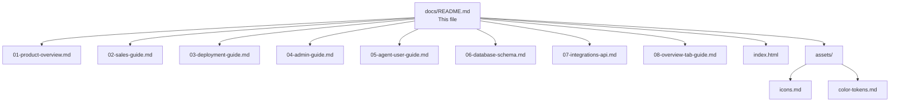

# Enterprise Ticket System — Documentation Hub

> **Build:** Passing &nbsp;|&nbsp; **Version:** 1.0.0 &nbsp;|&nbsp; **Phases:** 5 Complete &nbsp;|&nbsp; **Last Updated:** 2026-03

---

## Who Should Read What

| Your Role | Start With | Then Read |
|---|---|---|
| Stakeholder / Product Manager | [01 – Product Overview](01-product-overview.md) | [02 – Sales Guide](02-sales-guide.md) |
| DevOps / Integrator | [03 – Deployment Guide](03-deployment-guide.md) | [06 – Database Schema](06-database-schema.md) |
| Super Admin | [04 – Admin Guide](04-admin-guide.md) | [08 – Overview Tab Guide](08-overview-tab-guide.md) |
| Admin | [04 – Admin Guide](04-admin-guide.md) | [05 – Agent & User Guide](05-agent-user-guide.md) |
| Agent / End User | [05 – Agent & User Guide](05-agent-user-guide.md) | — |
| Sales / Pre-Sales | [02 – Sales Guide](02-sales-guide.md) | [01 – Product Overview](01-product-overview.md) |
| API Integrator | [07 – Integrations & API](07-integrations-api.md) | [06 – Database Schema](06-database-schema.md) |

---

## Document Index

1. [Product Overview](01-product-overview.md) — Executive one-pager, capabilities, architecture
2. [Sales Guide](02-sales-guide.md) — Feature matrix, competitive positioning, demo script
3. [Deployment Guide](03-deployment-guide.md) — Supabase setup, migrations, Netlify, CI/CD
4. [Admin Guide](04-admin-guide.md) — All admin flows, masters, SLA, automation, roles
5. [Agent & User Guide](05-agent-user-guide.md) — Daily ticket operations, notifications, profile
6. [Database Schema](06-database-schema.md) — All 24 tables, RLS, triggers, seed data
7. [Integrations & API](07-integrations-api.md) — API keys, webhooks, REST examples
8. [Overview Tab Guide](08-overview-tab-guide.md) — Super Admin control center documentation
9. [Interactive Demo](index.html) — Open in browser, no build required

### Assets
- [Icon Reference](assets/icons.md) — PrimeIcons used + inline SVG code
- [Color Tokens](assets/color-tokens.md) — Design token reference

---

## Tech Stack

| Layer | Technology | Version |
|---|---|---|
| Frontend Framework | Angular | 18.2 |
| UI Component Library | PrimeNG | 18.0.2 |
| Styling | Tailwind CSS | 3.4 |
| Backend / Database | Supabase (PostgreSQL) | Cloud |
| State Management | Angular Signals | (built-in) |
| Deployment | Netlify (static hosting) | — |
| Authentication | Supabase Auth (email/password) | — |

---

## System Structure

---

## Quick Reference — Roles

| Role | Access Level | Key Capabilities |
|---|---|---|
| **super_admin** | Full system access | Everything — including Overview tab, Workflow, Automation, Integrations |
| **admin** | Administrative | Masters, SLA, Reports, Audit Logs, all tickets |
| **agent** | Operational | Assigned tickets, all ticket list, comments |
| **end_user** | Self-service | Own tickets only, create + track |

---

## Getting Help

- For application errors: check the browser console and Supabase logs dashboard
- For deployment issues: see [Troubleshooting](03-deployment-guide.md#troubleshooting) in the Deployment Guide
- For data/schema questions: see [Database Schema](06-database-schema.md)
- For feature questions: raise a GitHub issue or contact your system vendor
