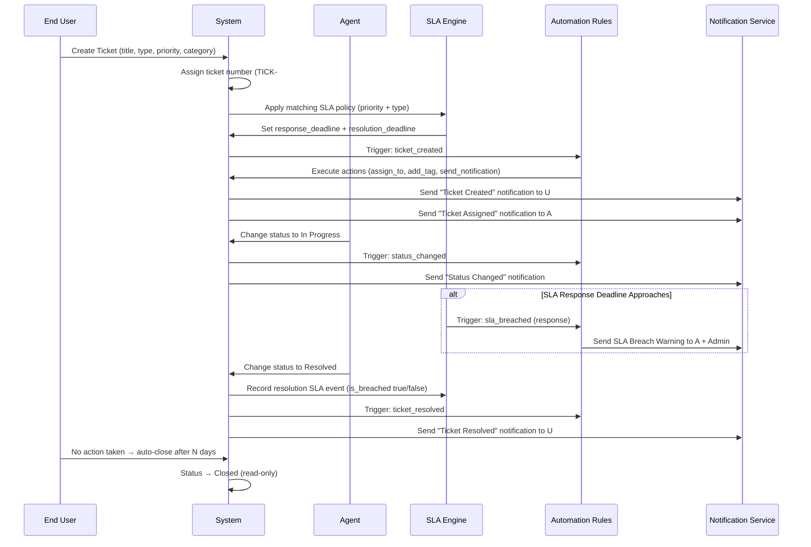
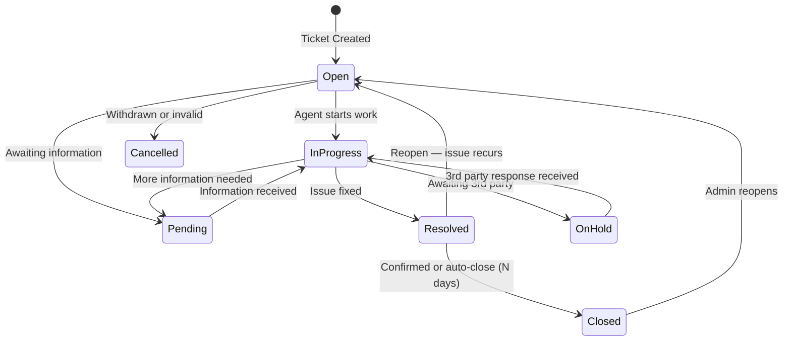
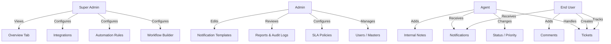

# System Guide — Built-in Interactive Onboarding (Enterprise Feature)

> **Enterprise Feature.** The System Guide is a built-in interactive step-by-step onboarding wizard available exclusively to Super Admins on the Overview page. It reduces training dependency and enables self-serve onboarding for new deployments.

---

## Purpose & Positioning

The System Guide answers the question: **"I just logged in as Super Admin — what do I do first?"**

Instead of reading external documentation or waiting for training, the Super Admin clicks a single button and is walked through the complete application setup flow in 9 animated steps — each with context, visual diagrams, and direct navigation links to the relevant configuration page.

### Enterprise Value Proposition

| Benefit | Detail |
|---|---|
| **Reduces onboarding time** | New Super Admins are productive in under 30 minutes |
| **Eliminates support dependency** | Self-serve onboarding for SaaS white-label customers |
| **Built-in, always current** | The guide reflects the actual live system — not a separate PDF |
| **Demonstrates professionalism** | Enterprise buyers expect guided setup experiences |
| **Handles complex ordering** | Explains *why* masters must be configured in a specific order |

---

## Access & Availability

| Who | How to open | Behaviour |
|---|---|---|
| **Super Admin** | Overview page → **System Guide** button (beside Refresh) | Opens 9-step animated dialog |
| Admin, Agent, End User | No access | Overview page is inaccessible; `/overview` redirects to `/unauthorized` |

The button is part of the `<app-page-header>` content projection in `OverviewComponent`. Since the entire `/overview` route is protected by `roleGuard(['super_admin'])` in `app.routes.ts`, no additional guard is needed on the button itself.

---

## UI Behaviour

### Opening the Guide

1. Navigate to **Sidebar → Overview** (Super Admin only)
2. Click the **"System Guide"** button (outlined primary, beside the Refresh button)
3. A full-screen modal dialog opens at Step 1

### Dialog Structure

```
┌────────────────────────────────────────────────────────────┐
│  📖 System Guide          Step 3 of 9                      │
│  ███████████░░░░░░░░░░░░░░░░░░  (progress bar, 33%)        │
│  ●●●●●○○○○  (dot indicators — click to jump to step)       │
├────────────────────────────────────────────────────────────┤
│                                                            │
│  [Step Content — fades in on navigation]                   │
│                                                            │
│  - Icon circle + title + subtitle                          │
│  - Main content (list / grid / diagram / table)            │
│  - 💡 Tip box (amber)                                      │
│                                                            │
├────────────────────────────────────────────────────────────┤
│  [← Previous]          3 / 9          [Next →]            │
└────────────────────────────────────────────────────────────┘
```

### Navigation

| Control | Action |
|---|---|
| **Next** button | Advance to next step |
| **Previous** button | Go back one step (disabled on Step 1) |
| **Dot indicators** | Jump directly to any step |
| **Finish** button (Step 9) | Closes the dialog |
| **X** button (dialog close) | Closes the dialog at any step |

### Animation

Each step content block carries the `animate-fade-in` Tailwind class (`fadeIn 0.2s ease-in-out`). Because Angular's `@switch / @case` destroys the previous DOM node and creates a new one on each navigation, the fade animation plays fresh every time — no JavaScript animation library required.

The progress bar uses a CSS `transition-all duration-500 ease-in-out` on the `width` property, giving a smooth fill animation as steps advance.

---

## The 9 Steps — Complete Reference

### Step 1: Welcome to Enterprise Ticket System

**Icon:** `pi-th-large` (blue) | **Audience:** Brand new Super Admin

**Content:**
- 4 capability cards: Ticket Lifecycle, Workflow Engine, SLA Engine, Automation Rules
- 4-role overview grid: Super Admin / Admin / Agent / End User
- Key message: "Complete Steps 2–6 in order before creating your first ticket"

---

### Step 2: Configure Core Masters — Do This First

**Icon:** `pi-database` (violet) | **Why critical:** All other features depend on master data

**Setup order (must be followed exactly):**

| Order | Master | Route | Why |
|---|---|---|---|
| 1 | Roles | Masters → Roles | Required for RLS access control. Seeded by default — verify only. |
| 2 | Departments | Masters → Departments | Used for agent assignment routing and ticket classification |
| 3 | Categories | Masters → Categories | Hierarchical — create parent categories first, then children |
| 4 | Priorities | Masters → Priorities | Required field on every ticket. Also carries the SLA multiplier |
| 5 | Statuses | Masters → Statuses | At least one must be set as "Is Default" for ticket creation |
| 6 | Ticket Types | Masters → Ticket Types | Each type can reference a workflow and custom field schema |
| 7 | Queues | Masters → Queues | Team routing buckets — assign agents for round-robin auto-assignment |

**Why order matters:** Statuses reference Categories. Priorities reference SLA Multipliers. Ticket Types reference Statuses. Creating them out of order results in empty dropdowns during setup.

---

### Step 3: SLA & Business Hours

**Icon:** `pi-clock` (emerald) | **Setup dependency:** Business Hours must be created before SLA Policies

**3-step setup flow:**

```
Create Business Hours Schedule → Create SLA Policy → System applies automatically to new tickets
```

**SLA Clock Behaviour:**

| State | Clock Status |
|---|---|
| Ticket created | Clock starts |
| Status → Pending / On Hold | Clock pauses |
| Status → In Progress / Open | Clock resumes |
| SLA deadline missed | is_breached = true, automation triggers |
| Status → Resolved / Closed | Clock stops |

**Best practice:** Create one SLA policy per priority level. SLA policies created after tickets are submitted do not apply retroactively.

---

### Step 4: Workflow Builder

**Icon:** `pi-sitemap` (purple) | **Access:** Super Admin only | **Route:** Sidebar → Workflow Builder

**Setup steps:**
1. Click **+ New Workflow**, set name, toggle **Is Default** ON
2. Add transitions: each transition defines From Status → To Status + allowed roles
3. Optionally add approval gates (Requires Approval toggle)
4. Go to **Masters → Ticket Types** and assign the workflow to each ticket type

**Common transitions:**

| From | To | Typical Roles |
|---|---|---|
| Open | In Progress | Agent, Admin |
| Open | Pending | Agent, Admin |
| In Progress | Resolved | Agent, Admin |
| Resolved | Closed | Admin |
| Resolved | Open | Any (reopen) |

**Optional:** Workflows can be skipped during initial setup. Without a workflow, all transitions are allowed. Add restrictions after your team is trained.

---

### Step 5: Automation Rules

**Icon:** `pi-bolt` (amber) | **Access:** Super Admin only | **Route:** Sidebar → Automation Rules

**Model:** `Trigger Event → Conditions → Actions`

**Trigger Events (10 available):**
`ticket_created`, `ticket_updated`, `ticket_assigned`, `ticket_resolved`, `ticket_closed`, `comment_added`, `sla_breached`, `status_changed`, `priority_changed`, `scheduled`

**Common examples:**

| Rule | Trigger | Condition | Action |
|---|---|---|---|
| Auto-Assign Critical | ticket_created | priority = Critical | assign_to senior agent |
| SLA Breach Alert | sla_breached | (any) | send_notification to assignee + admin |
| Escalate Stale | ticket_updated | status=Open, age>24h | set_priority=High |
| Webhook on Resolve | ticket_resolved | (any) | call_webhook to external ITSM |
| Tag VIP | ticket_created | title contains "VIP" | add_tag vip |

**Best practice:** Test rules on Low priority test tickets with "Stop on match" OFF.

---

### Step 6: Add & Manage Your Team

**Icon:** `pi-users` (sky) | **Route:** Masters → Users

**Invite flow:**
1. Go to **Masters → Users**
2. Click **+ Add User**
3. Fill in Full Name, Email, Role, Department
4. Click **Save** — Supabase sends an email invitation automatically
5. User clicks the link, sets password, logs in

**Role capabilities summary:**

| Role | What they can do |
|---|---|
| Super Admin | Full system control — all features, workflow, automation, integrations, Overview tab |
| Admin | User management, SLA, reports, audit logs, notification templates |
| Agent | Handle tickets, change status/priority, add internal notes, view all tickets |
| End User | Create tickets, view own tickets, add comments, receive notifications |

**Security:** Never delete the four system roles (super_admin, admin, agent, end_user). They are referenced by Row-Level Security policies in the database.

---

### Step 7: Ticket Lifecycle

**Icon:** `pi-ticket` (rose) | **Audience:** Understanding the operational flow

**Complete status flow:**

```
[Ticket Created]
      |
      v
    OPEN ──────────────────────────────┐
      |                                |
      v                                |
 IN PROGRESS ──── needs info ──> PENDING
      |                                |
      |  <──── info received ──────────┘
      |
      v
  RESOLVED ──── confirmed / auto-close ──> CLOSED
      |
      └──── issue recurs ──────────────> OPEN (reopen)

ESCALATED = flag on ticket, not a status
ON HOLD   = pause while awaiting 3rd party
CANCELLED = ticket withdrawn / invalid
```

**Status categories (drive SLA and dashboards):**

| Category | Color | Meaning |
|---|---|---|
| `open` | Blue | Awaiting pickup |
| `in_progress` | Violet | Being actively worked |
| `pending` | Amber | SLA clock paused — awaiting information |
| `resolved` | Green | Fixed, awaiting confirmation |
| `closed` | Slate | Complete, read-only |

**Key behaviours:**
- SLA clock pauses when status = Pending or On Hold
- The `is_escalated` flag is separate from status — it triggers escalation automations
- Closed tickets are read-only — only Super Admin can reopen
- Every status change is automatically written to the Audit Log

---

### Step 8: Notifications & Templates

**Icon:** `pi-bell` (orange) | **Route:** Notifications → Templates

**8 seeded templates (ready to use, fully customisable):**

| Template | Channel | When Sent |
|---|---|---|
| Ticket Created | In-App + Email | New ticket submitted |
| Ticket Assigned | In-App + Email | Ticket assigned to agent |
| Status Changed | In-App | Status changes on ticket |
| SLA Breach Warning | In-App + Email | SLA approaching (80% used) |
| SLA Breached | In-App + Email | SLA deadline missed |
| Ticket Resolved | In-App + Email | Ticket moves to resolved |
| Comment Added | In-App | New comment posted |
| Mentioned in Comment | In-App | User @mentioned in comment |

**Handlebars variables available in template bodies:**

```
{{ ticket_number }}   → TICK-00042
{{ ticket_title }}    → Cannot access VPN
{{ recipient_name }}  → Alice Johnson
{{ ticket_url }}      → https://app.co/tickets/...
{{ agent_name }}      → Bob Smith
{{ status_name }}     → In Progress
{{ priority_name }}   → Critical
```

---

### Step 9: Integrations & Going Live

**Icon:** `pi-link` (teal) | **Route:** Sidebar → Integrations

**Webhooks:**
- POST ticket event payloads to any external URL
- Subscribe per-event type (ticket_created, sla_breached, etc.)
- HMAC-SHA256 signature for payload verification
- Failure count tracked for alerting

**API Keys:**
- Format: `etk_` prefix + SHA-256 hash
- Per-permission scopes: `tickets:read`, `tickets:write`, `comments:write`, etc.
- Shown only once at creation — store securely
- Used in HTTP header: `Authorization: Bearer etk_...`

**Production Readiness Checklist:**

- [ ] Supabase auth configured — Email provider enabled, Site URL = production domain
- [ ] All 10 migrations applied — 24 tables visible in Supabase Table Editor
- [ ] Super Admin user promoted — `profiles.role_id` = super_admin UUID
- [ ] SLA policies created — at least one per priority level
- [ ] Default status set — exactly one status has `Is Default = ON`
- [ ] Netlify SPA redirect active — `netlify.toml [[redirects]] /* → /index.html`
- [ ] System Overview verified — all Configuration Status rows show green ✓

---

## Mermaid Diagrams

### Complete Ticket Processing Sequence



---

### Ticket Lifecycle State Diagram



---

### Role Interaction Diagram



---

## Database Tables Affected Per Setup Step

| Setup Step | Tables Written |
|---|---|
| Step 2 — Core Masters | `roles`, `departments`, `categories`, `priorities`, `statuses`, `ticket_types`, `queues` |
| Step 3 — SLA | `business_hours`, `sla_policies` |
| Step 4 — Workflow | `workflow_definitions`, `workflow_transitions`, `approval_rules` |
| Step 5 — Automation | `automation_rules` |
| Step 6 — Users | `profiles` (via Supabase auth trigger `handle_new_user`) |
| Ticket Operations | `tickets`, `ticket_comments`, `ticket_attachments`, `sla_events`, `audit_logs`, `notifications` |
| Step 8 — Notifications | `notification_templates` |
| Step 9 — Integrations | `webhook_configs`, `api_keys` |

---

## Sales Material — Talking Points

> **"Built-in Interactive System Onboarding Guide"** — an enterprise feature of the Enterprise Ticket System.

### Key Messages for Sales Conversations

- **"No external training required."** The guide walks new admins through every setup step in under 30 minutes — entirely within the product.
- **"Ideal for SaaS white-label deployments."** Each new customer tenant gets the same structured onboarding experience, reducing your support load.
- **"The guide reflects the live system."** Unlike PDFs or external help centres, the in-app guide always matches the current version — no documentation drift.
- **"9 steps, 9 minutes to understand."** Even a non-technical stakeholder can follow the guide to see how the system works end-to-end.

### Positioning vs Competitors

| Feature | Enterprise Ticket System | Jira Service Management | Zendesk |
|---|---|---|---|
| Built-in onboarding guide | ✓ In-app, animated, 9-step | ✗ External documentation only | ✗ External help centre only |
| Admin-only access control | ✓ roleGuard + RLS | Partial | Partial |
| Self-hosted option | ✓ Any static host | ✗ SaaS only | ✗ SaaS only |
| Open database | ✓ Supabase PostgreSQL | ✗ Proprietary | ✗ Proprietary |

---

## Onboarding Verification Checklist

After deployment, verify the System Guide works correctly:

- [ ] Sign in as Super Admin → Overview page loads
- [ ] "System Guide" button is visible beside the Refresh button
- [ ] Click button → dialog opens at Step 1, progress bar shows ~11%
- [ ] Step 1 content displays 4 capability cards and 4 role cards
- [ ] Click dot indicator for Step 5 → jumps directly, content fades in
- [ ] Navigate Next through all 9 steps → progress bar reaches 100%
- [ ] Step 9 shows "Finish" button instead of "Next"
- [ ] Click "Finish" → dialog closes
- [ ] Sign in as Admin → navigate to `/overview` → redirected to `/unauthorized`
- [ ] System Guide button never appears for Admin, Agent, or End User

---

*Implementation: `src/app/features/overview/overview.component.ts` — `guideVisible`, `currentStep`, `openGuide()`, `nextStep()`, `prevStep()` signals and methods added to the existing `OverviewComponent`. No new route or component file created.*
